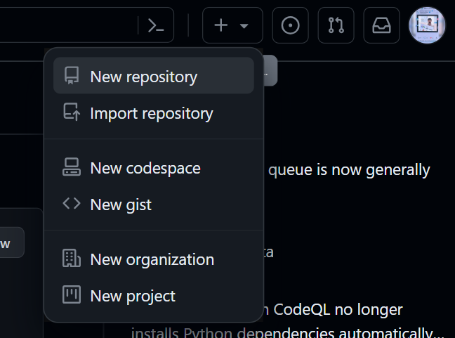
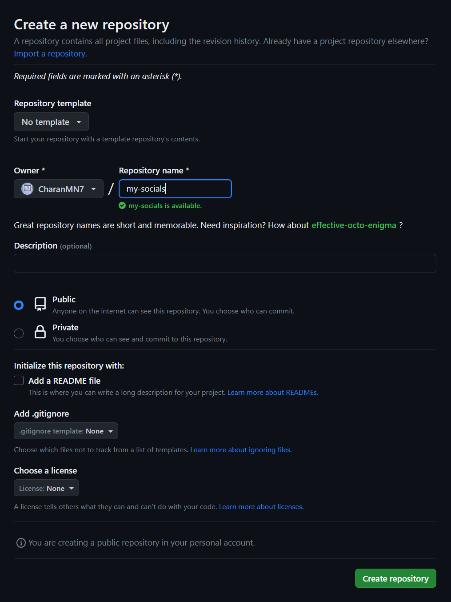
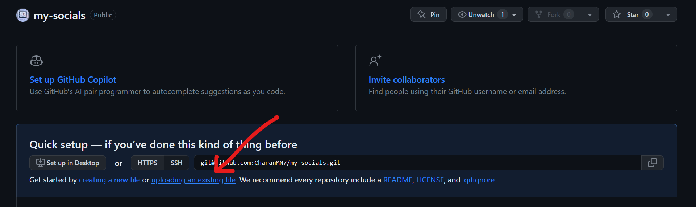
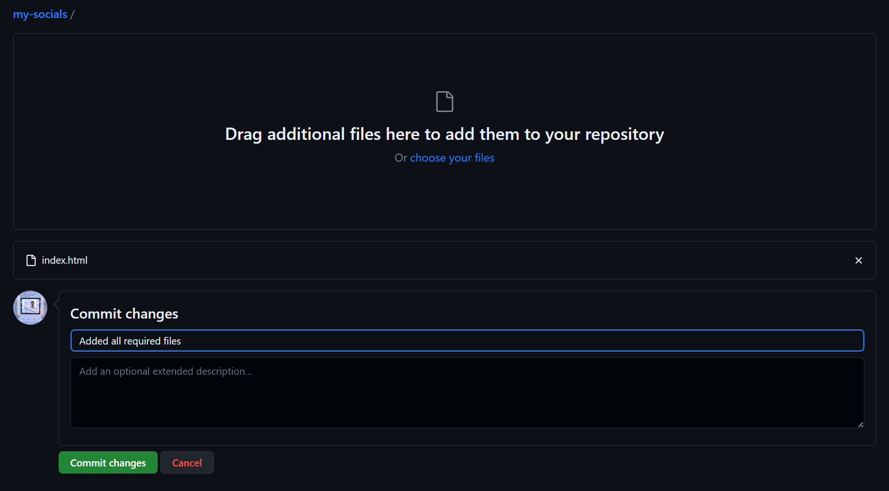
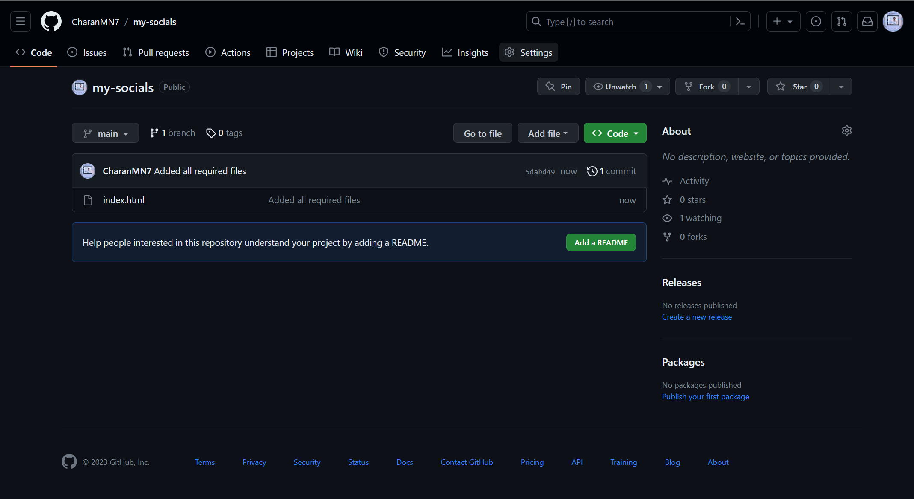
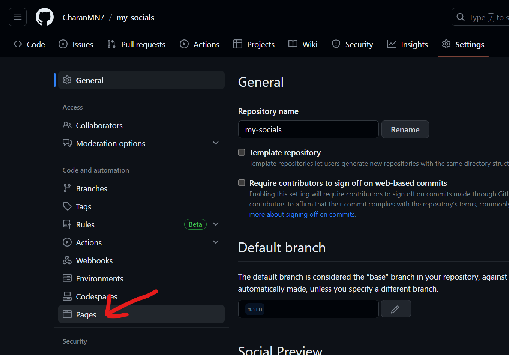
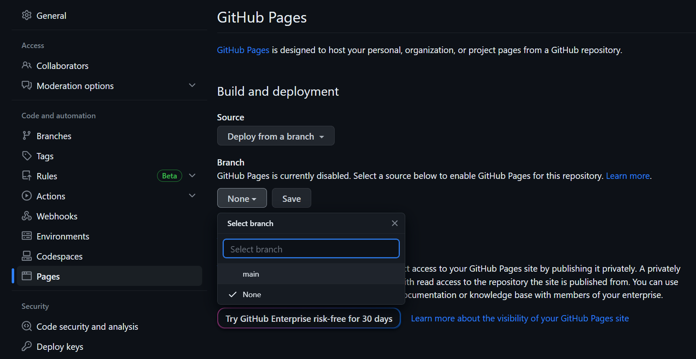
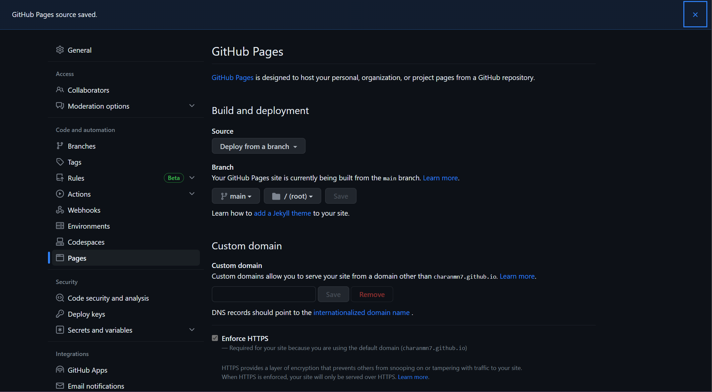

# Host Your Webpage On GitHub Pages For Free!

**Step 1:** Whether you've created a new account or already been using one, you'll see a plus icon on the top-right corner of your page. Clicking on it will display a menu. Now click on "__New Repository__."

**Step 2:** Give the new repository. Also, make sure that the repository is set to be "__public__". Otherwise, you won't be able to host your webpage. And when you're done click on the "__Create repository__ button to create your new repository.

**Step 3:** Click on "__upload an existing file__" to upload the `index.html` file you created using the *Linkfree-Generator*.

**Step 4:** Drag and drop or choose your `index.html` from the file explorer or finder to upload it to the repository and click on "__Commit changes__."

**Step 5:** Now you'll see your repository and the `index.html` file in it. Click on "__Settings__".

**Step 6:** Go to "__Pages__"

**Step 7:** Click on the Branch dropdown, select `main`, and hit "__Save__"

**Step 8:** You should the message "GitHub Pages source saved," like below. Wait for a minute or two and refresh the page.

**Step 9:** Congratulations! You have successfully hosted your webpage! You can now use the URL provided by GitHub to visit your site!  

Optionally, if you have your domain, you can use it here through the "__Custom Domain__". Just enter your custom domain and hit save.

