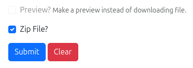
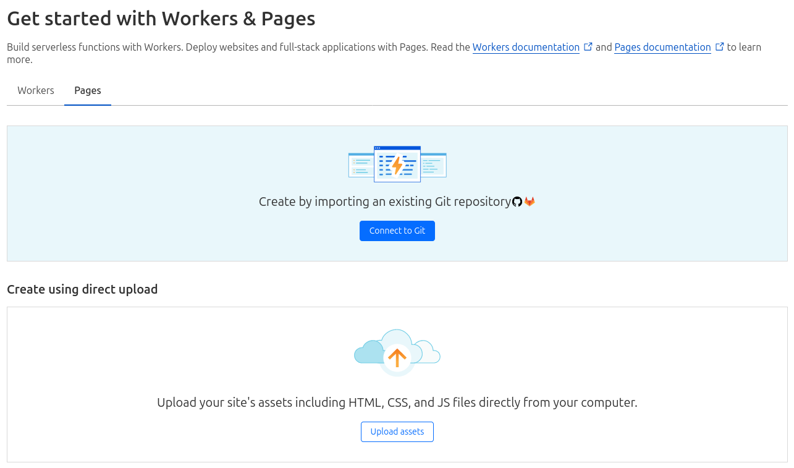
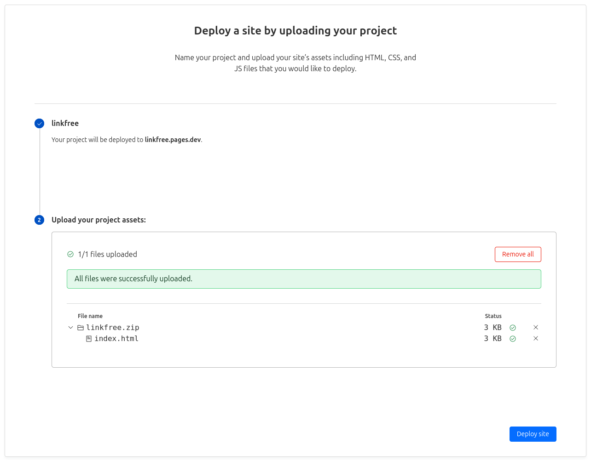

# Host your website on Cloudflare Pages

## Step 1

[Create a linkfree using the form](https://linkfree.ckt.im) making sure to check the "Zip File?" checkbox. After submitting the form, you'll receive a zip file.

## Step 2

Create a Cloudflare account if you don't have one and [click on this link](https://dash.cloudflare.com/?to=/:account/workers-and-pages/create/pages) to create a new pages project. If the link does not work, you can navigate to "Workers and Pages" and then 

## Step 3

Click on the "Upload assets" button, enter a project name, upload the zip file you received from the linkfree form, and click "Deploy site".

