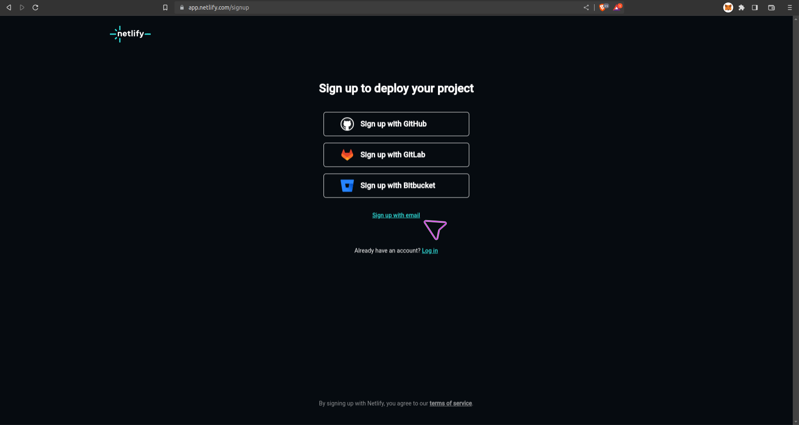
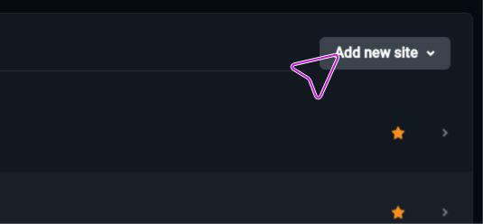
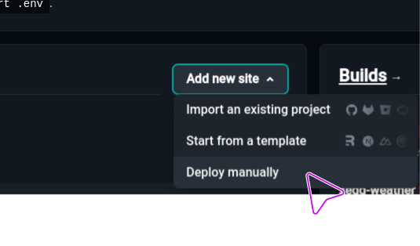
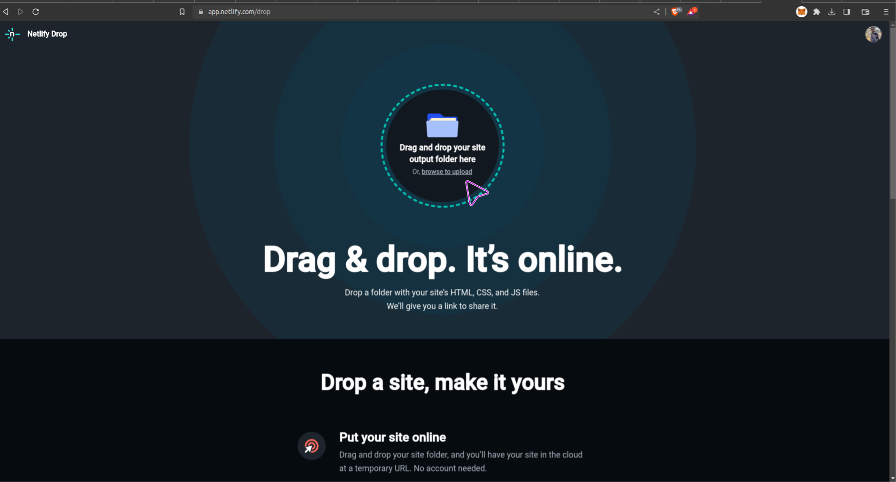
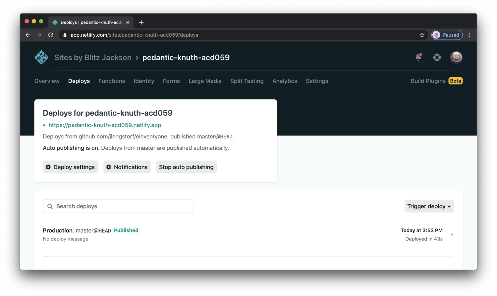
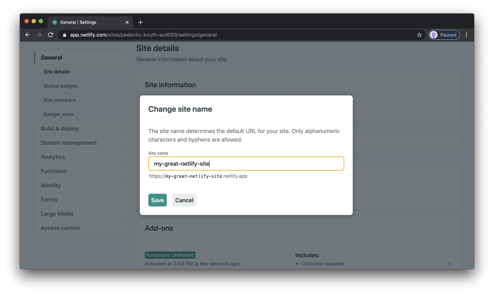

# Host Your Webpage On Netlify For Free

This docs would show you how to easily host your webpage on netlify

## Step 1

Open a new web page and search this website [Netlify](https://netlify.app)

## Step 2

If you have an account already, you can decide to login but if you don't, click on signup button
you can then choose signup with email. If you already have a `Github Account` then you should refer to this docs [Github Docs](./GitHub-Pages.md)

## Step 3

After signing up, you should see a dashboard, click on the add new site button

## Step 4

Then click on deploy manually

## Step 5

This would prompt you to drag or drop or upload your folder, remember you have to move the index.html file to a new folder, that's the folder you would upload.

## Step 6

After uploading, you would be taken back to the dashboard where you would see your site being eploye.

## Step 7

You can then click on the overview tab, then on site settings so you can change your site name to what ever you want

## Step 8

Congratulations! You have successfully hosted your webpage! You can now use the URL provided by Netlify to visit your site!
