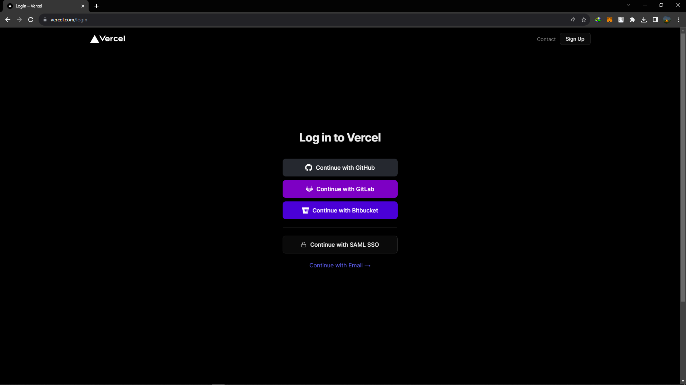
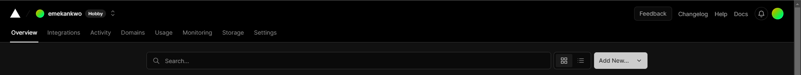
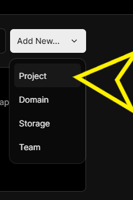
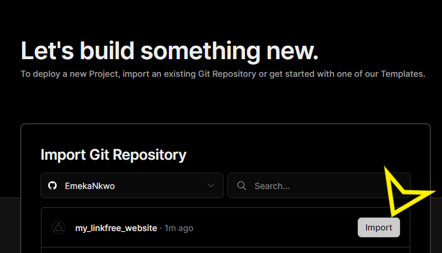
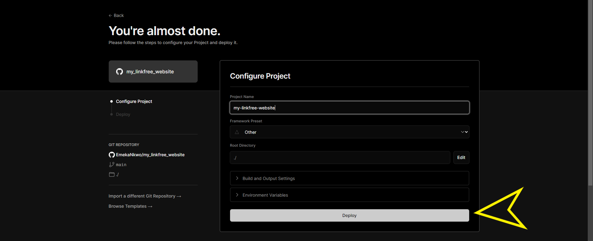
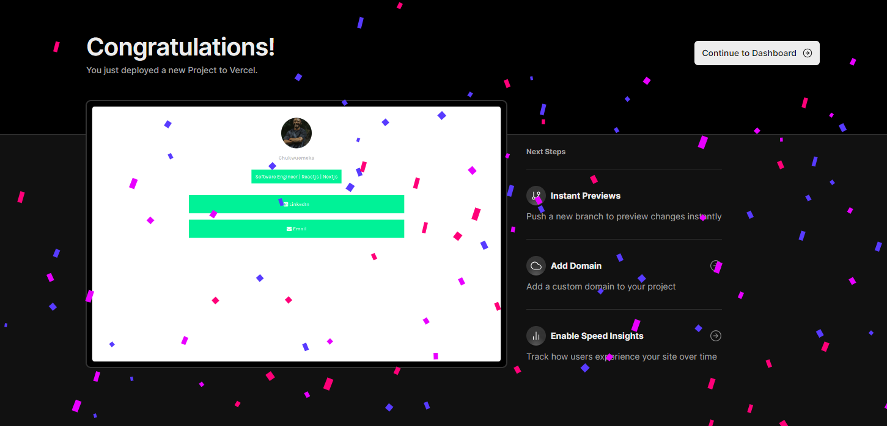

# Host Your Webpage On Vercel For Free

This docs would show you how to easily host your webpage on Vercel

## Step 1

Create a new repository on Github or Gitlab or Bitbucket. Upload the `index.html` file to the repository.

## Step 2

Open a new web page and search this website [Vercel](https://vercel.com)

## Step 3

If you have an account already, you can decide to login but if you don't, click on signup button
you can then choose signup with email. If you already have a `Github Account` or `Gitlab Account` or `Bitbucket Account`

## Step 4

After signing up, you will be navigate to the dashboard, click on the `Add New` button

## Step 5

Then click on Add New

## Step 6

This will show a list of options, click on Project

## Step 7

This will take you to a window, where you can select the repository you want to deploy. Select the repository you created in `Step 1` that contains the `index.html` file. Then click on continue

## Step 8

After clicking continue, this takes you to a page where you can configure and get an overview of your project, Click on `deploy` to deploy your project

## Step 9

Congratulations! You have successfully hosted your webpage! You can now use the URL provided by Vercel to visit your site!

